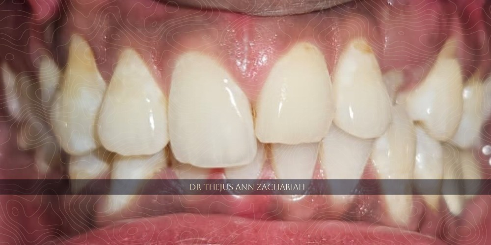
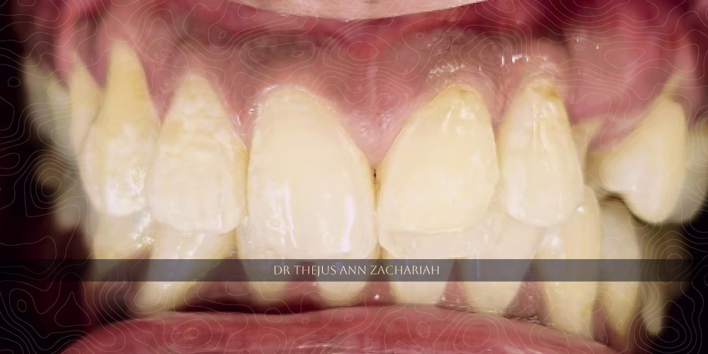
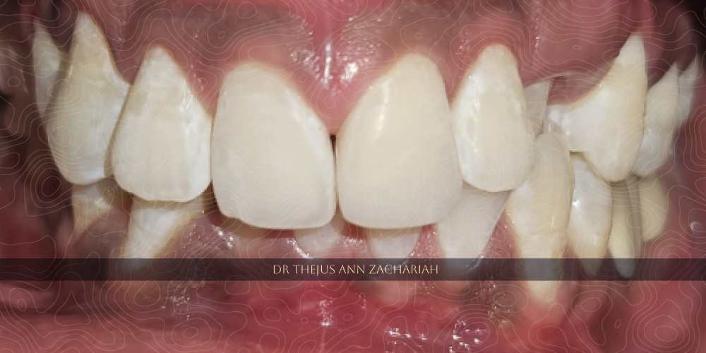

| Case | Description |
| :---- | :-- |
| Patient   | 31 year old male patient |
| Chief Complaint & HOPI | Broken tooth in upper front tooth region since 2 years, h/o self fall 2 years back, occasional sensitivity to hot and cold stimuli |
| Oral Evaluation | Elli's Class II fracture wrt 21, pulp sensibility testing positive with cold test |
| Treatment Plan | Class IV buildup with direct composite resin |

# Class IV Build Up - 21

## Pre-Operative

## Palatal Shelf Build Up

## Post-Operative

