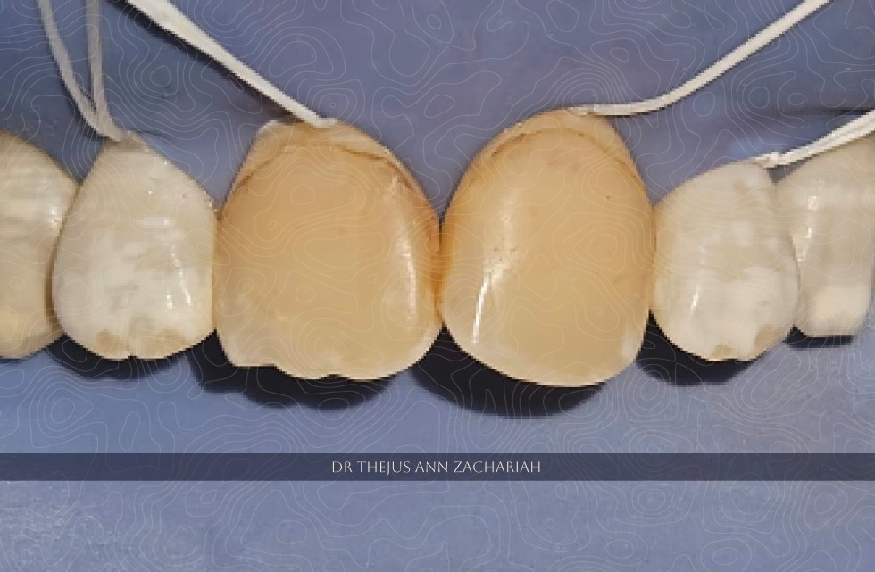
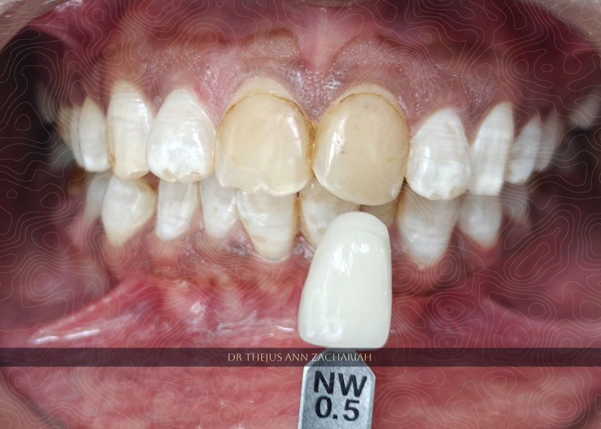
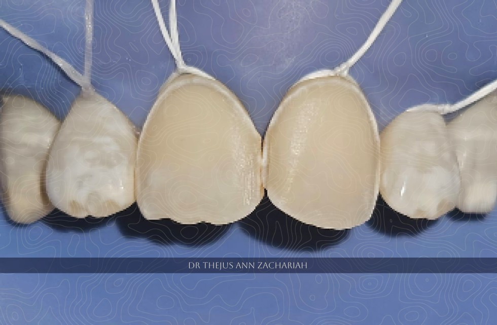
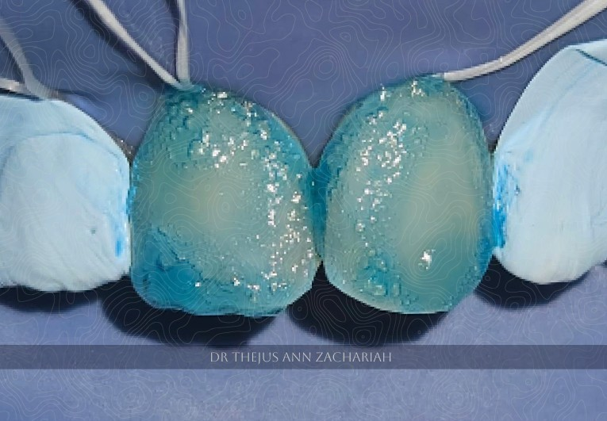
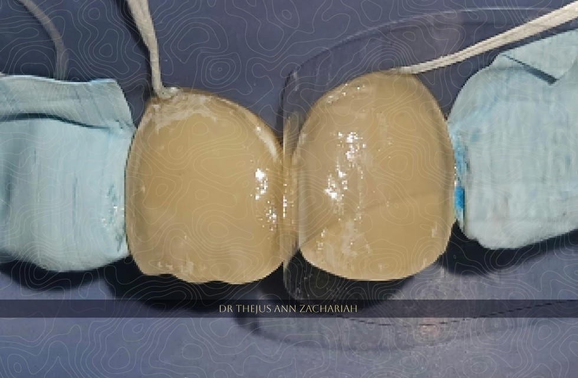
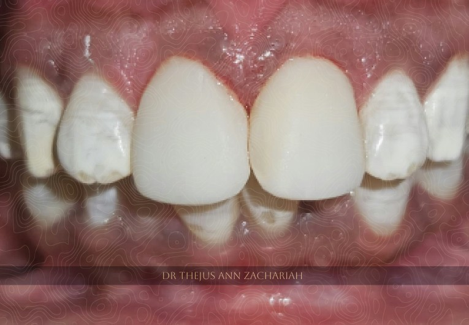
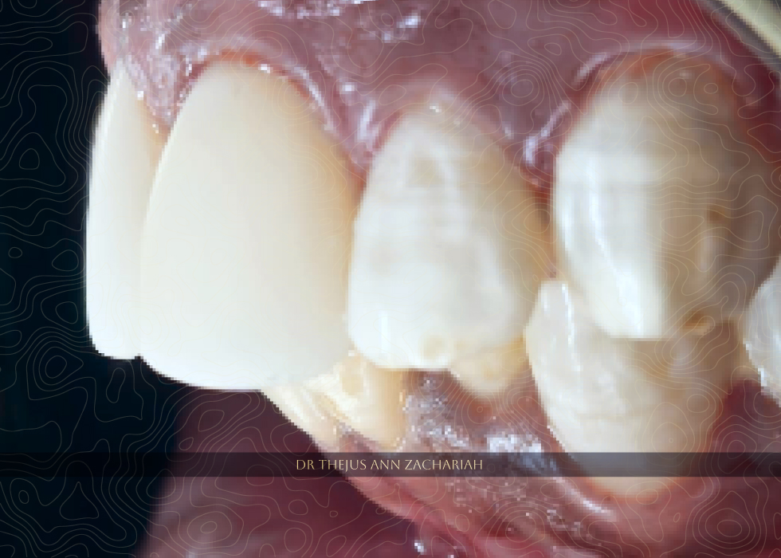
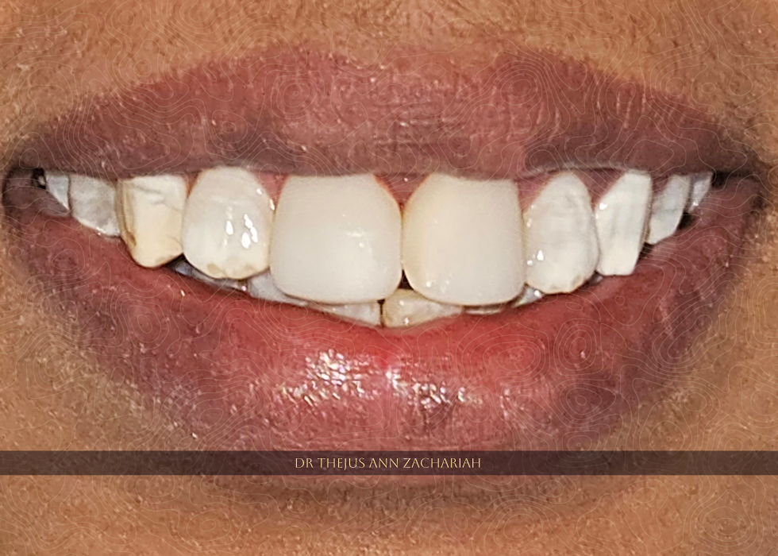

| Case | Description |
| :---- | :-- |
| Patient   | 33 year old female patient |
| Chief Complaint & HOPI | Discoloured upper front tooth region, h/o composite restoration wrt 11 and 21 - 15 years back, discoloured snce 2 years |
| Oral Examination | Discoloured previous direct composite resin restoration wrt 11 and 21, genaralised mild flurosis with white patches |
| Treatment Plan | Shade selection and direct composite veneering wrt 11 and 21 - bleaching white shade |

## Pre-Operative

## Shade Selection

## Tooth Preparation

## Acid Etching

## Bonding Agent Application

## Veneer Post Polishing 

## Profile View

## Her regained smile

