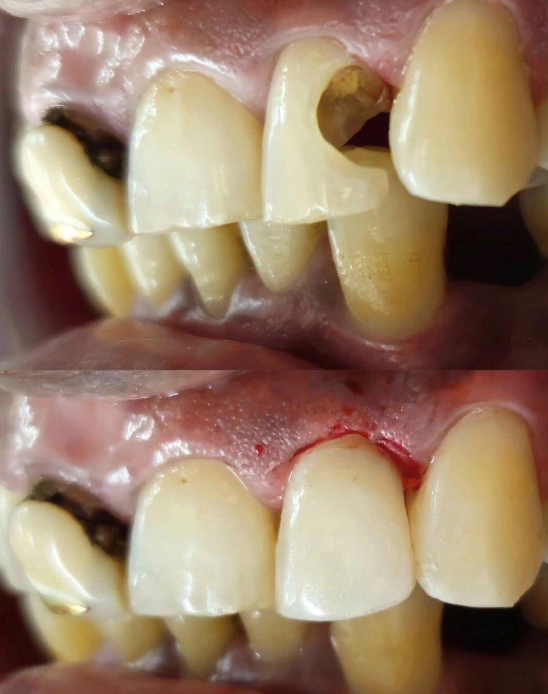

## Dexterity, Determination and Dedication

## Bleaching
Bleaching is a conservative, noninvasive, and inexpensive line of treatment for discolourations in indicated cases, for a better smile.

## Isolation With Dental Dam

## Good As New

> "Wherever the art of medicine is loved, there is also a love of humanity - Hippocrates

