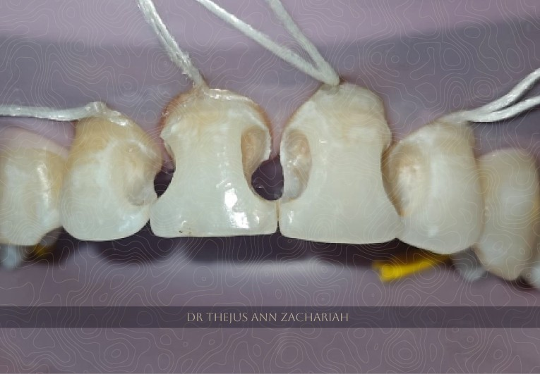
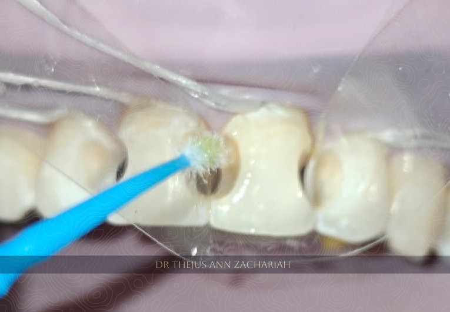
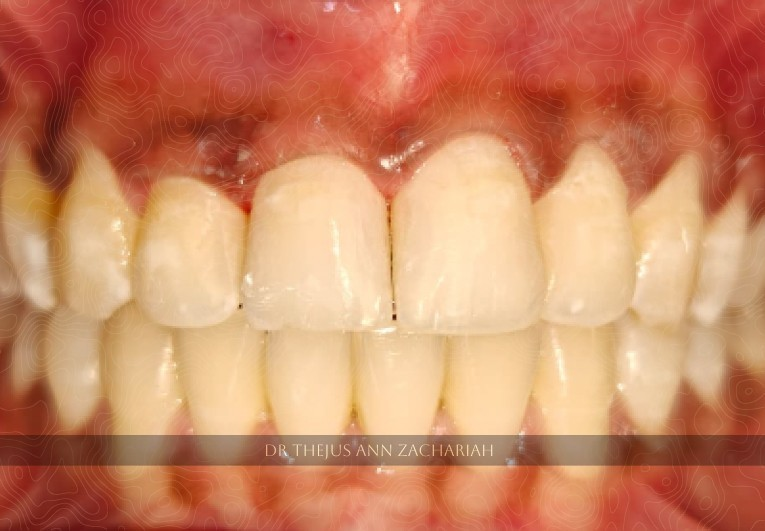

> MULTIPLE CLASS III COMPOSITE RESTORATIONS- 11, 12, 21, 22

| Case | Description |
| :---- | :-- |
| Patient   | 26 year old female patient |
| Chief Complaint & HOPI | Decay in upper front tooth region since 1 year  |
| Oral Examination | Class III caries wrt 11, 12, 21, 22 |
| Treatment Plan | Caries excavation and evaluation for direct composite restoration wrt 11, 12, 21, 22 |

## Caries Excavation

## Selective Acid Etching

## Bonding Agent Application 

## Post-Operative

