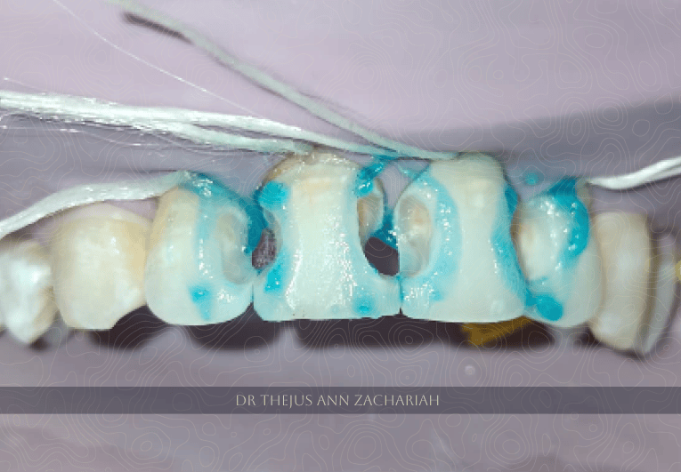

> MULTIPLE CLASS III COMPOSITE RESTORATIONS- 11, 12, 21, 22

| Case | Description |
| :---- | :-- |
| Patient   | 26 year old female patient |
| Chief Complaint | Decay in upper front tooth region since 1 year  |
| Oral Evaluation | Class III caries wrt 11, 12, 21, 22  |
| Treatment Plan | Caries excavation  |

## Caries Excavation

## Selective Acid Etching

## Bonding Agent Application 

## Post Operative

