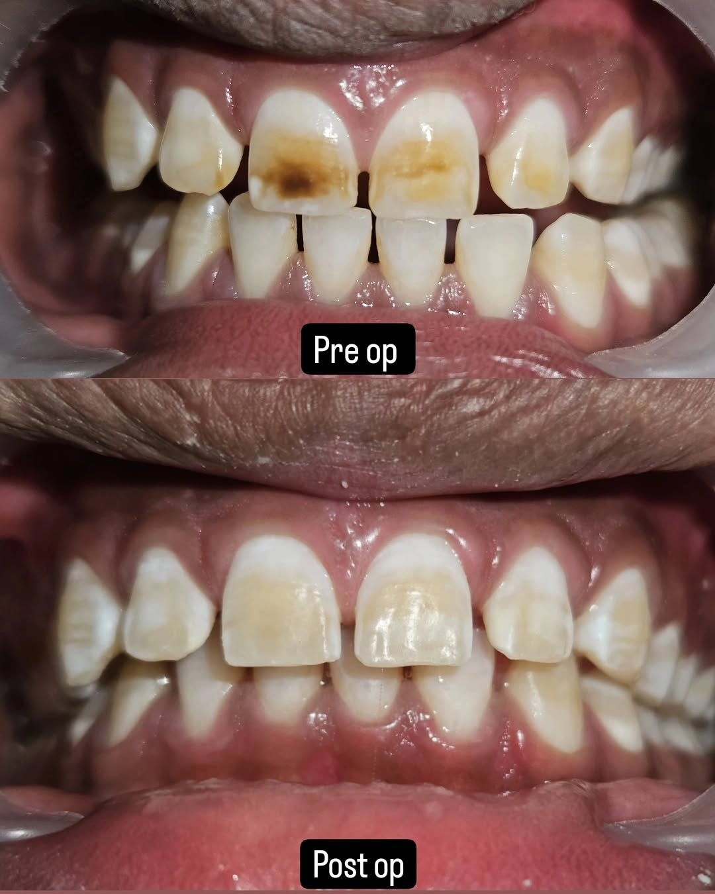
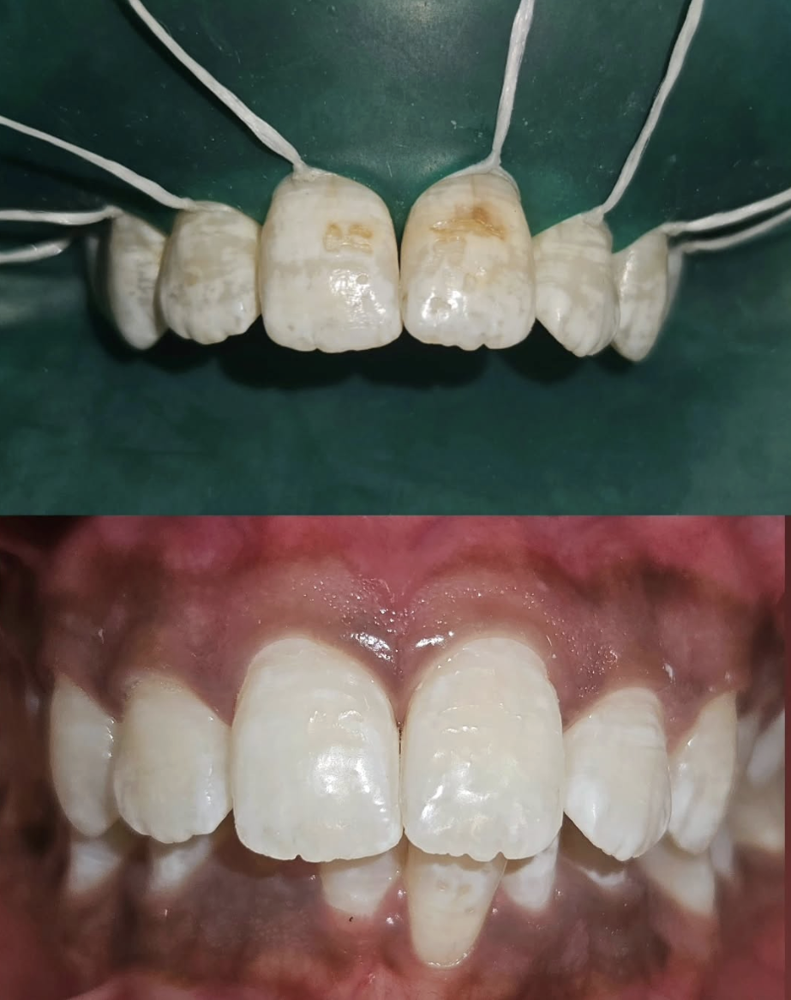

 

> "Wherever the art of medicine is loved, there is also a love of humanity - Hippocrates

#### Bleaching
Bleaching is a conservative, noninvasive, and inexpensive line of treatment for discolourations in indicated cases, for a better smile.

#### Dexterity, Determination and Dedication

#### Isolation With Dental Dam

#### Good As New

